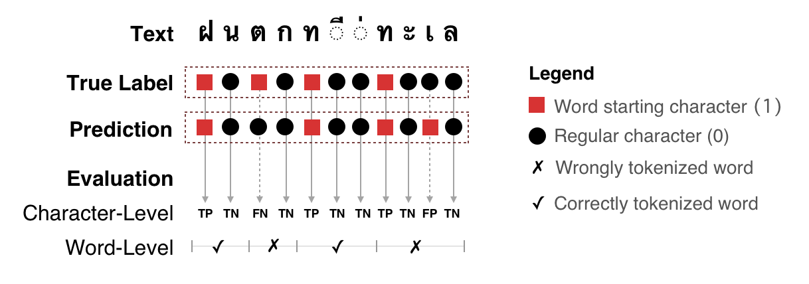

.. currentmodule:: pythainlp.benchmarks

pythainlp.benchmarks
====================

Introduction
------------

The `pythainlp.benchmarks` module is a collection of utility functions designed for benchmarking tasks related to Thai Natural Language Processing (NLP). Currently, the module includes tools for word tokenization benchmarking. Please note that additional benchmarking tasks will be incorporated in the future.

Tokenization
------------

Word tokenization is a fundamental task in NLP, and it plays a crucial role in various applications, such as text analysis and language processing. The `pythainlp.benchmarks` module offers a set of functions to assist in the benchmarking and evaluation of word tokenization methods.

Quality Evaluation
^^^^^^^^^^^^^^^^^^

The quality of word tokenization can significantly impact the accuracy of downstream NLP tasks. To assess the quality of word tokenization, the module provides a qualitative evaluation using various metrics and techniques.

   Qualitative evaluation of word tokenization.

Functions
---------

.. autofunction:: pythainlp.benchmarks.word_tokenization.compute_stats

    This function is used to compute various statistics and metrics related to word tokenization. It allows you to assess the performance of different tokenization methods.

.. autofunction:: pythainlp.benchmarks.word_tokenization.benchmark

    The `benchmark` function facilitates the benchmarking of word tokenization methods. It provides an organized framework for evaluating and comparing the effectiveness of different tokenization tools.

.. autofunction:: pythainlp.benchmarks.word_tokenization.preprocessing

    Preprocessing is a crucial step in NLP tasks. The `preprocessing` function assists in preparing text data for tokenization, which is essential for accurate and consistent benchmarking.

Usage
-----

To make use of these benchmarking functions, you can follow the provided examples and guidelines in the official PyThaiNLP documentation. These tools are invaluable for researchers, developers, and anyone interested in improving and evaluating Thai word tokenization methods.
